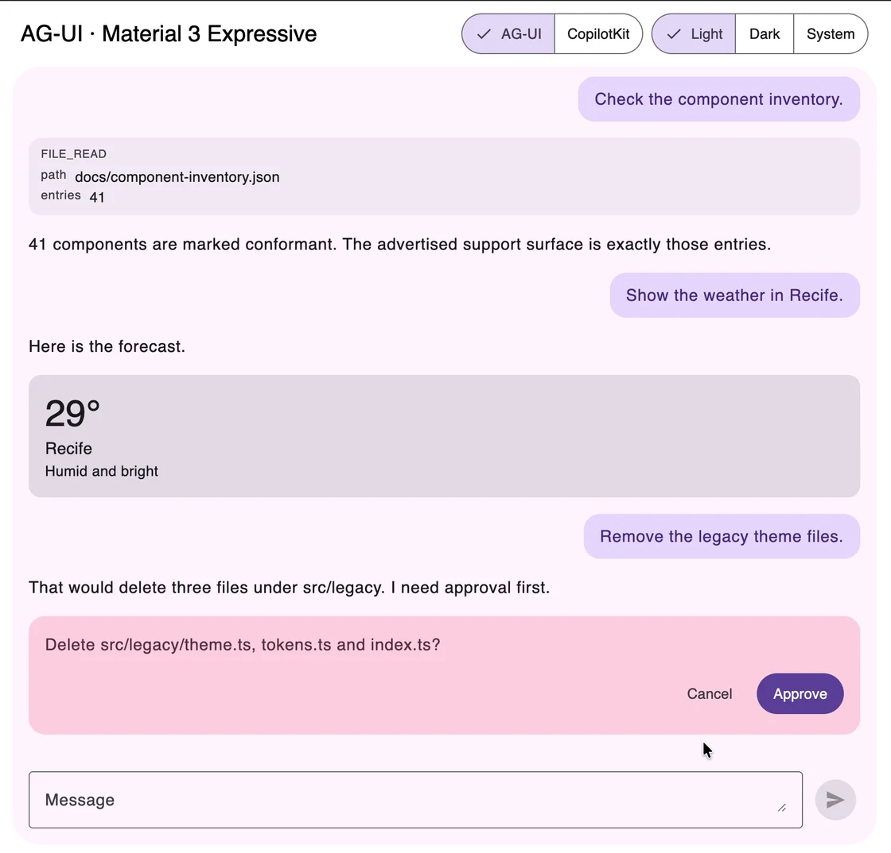

# Material 3 Expressive for AG-UI

[](https://www.npmjs.com/package/@language-lit/material3-expressive-ag-ui)
[](https://github.com/Language-Lit/material3-expressive-ag-ui/actions/workflows/verify.yml)

React components for [AG-UI](https://github.com/ag-ui-protocol/ag-ui) agent
interfaces: streaming conversations, reasoning, tool calls, generative UI, and
human approval prompts. Built on
[Material 3 Expressive](https://m3e.language-lit.com), with shared theming
across your chat and app controls.

[Live demo & docs](https://m3e.language-lit.com/ag-ui/) ·
[Quick start](#quick-start) ·
[CopilotKit setup](#copilotkit) ·
[npm](https://www.npmjs.com/package/@language-lit/material3-expressive-ag-ui)

Published as `@language-lit/material3-expressive-ag-ui`, version **0.1.0**.
This is an independent community implementation.

[](https://m3e.language-lit.com/ag-ui/)

*Generative UI and human approval in the scripted playground. [Try the demo](https://m3e.language-lit.com/ag-ui/).*

## What you get

- **Streaming conversations** — assistant and user turns, reasoning disclosures,
  tool-call cards, activity, run status, and a send/stop composer.
- **Generative UI** — register a component per tool name and render it while the
  arguments are still streaming.
- **Human approval** — show interrupts in the transcript and resume the run
  after the user responds.
- **Material theming** — follow your app's light/dark mode, density, and design
  tokens through `Material3Provider`.
- **Composable UI** — start with `AgentChat`, or arrange the ten components into
  your own panel or page. Read shared agent state through the React binding.

The package has no bundled runtime dependencies: it uses your installed React,
AG-UI SDK, and Material design system. CopilotKit is optional.

## Choose your integration

| Your app | How to connect |
| --- | --- |
| Uses AG-UI directly | Supply an `AbstractAgent`, such as `HttpAgent`, to `AgentProvider` and render `AgentChat`. CopilotKit is not required. |
| Uses CopilotKit 1.71.x v1 slots | Apply the [renderer preset](#copilotkit). CopilotKit continues to own the agent, transport, tools, and interrupts. |

To explore before connecting a backend, try the
[live demo](https://m3e.language-lit.com/ag-ui/) or run the
[local playground](#development), which uses scripted agents and needs no API key.

## Quick start

You need a React 18 or 19 application and an agent backend that serves AG-UI.
The `/api/agent` URL below is a placeholder for that endpoint; this package
does not create a backend. You can also supply your own `AbstractAgent` instance.

### Install

```sh
npm install @language-lit/material3-expressive-ag-ui \
            @language-lit/material3-expressive \
            @ag-ui/client @ag-ui/core
```

The design system, `@ag-ui/client`, and `@ag-ui/core` are peer dependencies,
along with `react` and `react-dom` (18 or 19). The command assumes React and
React DOM are already installed in your app. See [compatibility](#compatibility-and-limits)
for the supported version ranges.

### Connect an agent

Import both stylesheets once, at your app's root, in this order:

```ts
import '@language-lit/material3-expressive/styles.css'
import '@language-lit/material3-expressive-ag-ui/styles.css'
```

Then mount the design system's provider, bind an agent, and render:

```tsx
'use client'

import { Material3Provider } from '@language-lit/material3-expressive'
import { AgentChat, AgentProvider } from '@language-lit/material3-expressive-ag-ui'
import { HttpAgent } from '@ag-ui/client'
import { useMemo } from 'react'

export function Chat() {
  const agent = useMemo(() => new HttpAgent({ url: '/api/agent' }), [])

  return (
    <Material3Provider>
      <AgentProvider agent={agent}>
        <AgentChat emptyState={<p>How can I help?</p>} />
      </AgentProvider>
    </Material3Provider>
  )
}
```

### Compose your own layout

`AgentChat` is the most common arrangement of the parts. For a docked
panel, a split view, or a thread with no composer, compose them yourself:

```tsx
import { Composer, MessageThread, RunStatus } from '@language-lit/material3-expressive-ag-ui'

<AgentProvider agent={agent}>
  <MessageThread />
  <RunStatus />
  <Composer placeholder="Ask anything" />
</AgentProvider>
```

### Driving it yourself

`useAgentContext()` returns everything the provider bound:

```tsx
const { timeline, state, phase, isRunning, steps, interrupts, error,
        send, run, stop, resolveInterrupt, setState } = useAgentContext()
```

Call `useAgent(agent)` directly only if you are not using the provider — one
agent should be bound once, or you get two subscriptions and two `send` paths.
The hook uses `useSyncExternalStore` to bind the SDK's mutable agent to React.

### Generative UI

Register a component per tool name. It is called while arguments are still
arriving, so `node.args` may be partial — that is what lets the UI fill in
progressively instead of popping in when the call closes.
`WeatherCard` below is your own component; the
[playground example](playground/App.tsx) shows a working renderer.

```tsx
<AgentProvider
  agent={agent}
  toolRenderers={{
    show_weather: ({ node }) => (
      <WeatherCard
        city={node.args?.city as string | undefined}
        temperature={node.args?.temperature as number | undefined}
      />
    ),
  }}
>
  <AgentChat />
</AgentProvider>
```

Tool names with no renderer fall back to `ToolCallCard`.

### Shared state and editable forms

The source now includes `useAgentDraft` for editable forms: drafts survive
incoming snapshots/deltas, changed proposals require explicit review, and approval
sends the proposal ID, expected revision, and draft changes. Plug a versioned
form into `AgentProvider.interruptRenderer` to use it inside `AgentChat`.

These safeguards are **not yet in npm 0.1.0**. In this source version, direct
`setState()` calls during a run throw rather than accepting an edit the SDK may
overwrite. Paused/idle state replacement remains supported. The default approval
prompt also requires review when its state changes.

See [shared state and approvals](docs/SHARED_STATE.md) for setup and the required
backend revision check. Try **Shared state** in the local playground for a working
draft/edit/approve flow, including a simulated stale server response.

### Human in the loop

A run that stops for permission finishes with an interrupt. `InterruptPrompt`
renders it inside the transcript and `resolveInterrupt` resumes the run through
the SDK's own `buildResumeArray`, so nothing is replaced and the conversation
continues:

```tsx
await resolveInterrupt(interruptId, { status: 'resolved' })
```

### Without React

The projection is published on its own. No React, no DOM, no `'use client'`:

```ts
import { projectTimeline, reduceRunOverlay, createRunOverlay }
  from '@language-lit/material3-expressive-ag-ui/protocol'
```

Useful for server-rendering a transcript, for analytics over recorded runs, or
for a host that is not React.

## CopilotKit

For an existing CopilotKit **v1** application, install its optional peers:

```sh
npm install @copilotkit/react-core@~1.71.0 @copilotkit/react-ui@~1.71.0
```

Keep the same Material provider and two stylesheets from the setup above, then
use the adapter inside your existing `CopilotKit` provider:

```tsx
import { CopilotChat } from '@copilotkit/react-ui'
import { copilotKitComponents } from '@language-lit/material3-expressive-ag-ui/copilotkit'

<CopilotChat {...copilotKitComponents} />
```

The same preset works with `CopilotPopup` and `CopilotSidebar`, including a
Material dialog, header, and launcher.

Do not mount this package's `AgentProvider` around the adapter. CopilotKit owns
the agent, transport, actions and interrupts. Register tool and interrupt
renderers with CopilotKit as usual; their UI and response callbacks are retained.

Read the [CopilotKit integration guide](docs/COPILOTKIT.md) for layout classes,
styles, fallback tool renderers, media handling, exported slots, and peer setup.

## Compatibility and limits

- **React / React DOM:** 18 or 19.
- **Material 3 Expressive:** `^1.2.0`.
- **AG-UI client / core:** declared peers `>=0.0.50`; tested with `0.0.59`.
- **CopilotKit:** optional, `~1.71.0`, tested with `1.71.0` v1 slots.
  The v2 slot API is not supported.
- **Text:** plain text by default in both integrations; Markdown and syntax
  highlighting are not included. Native `AgentChat` and `MessageThread` have
  no message-renderer override. For rich text, compose a custom transcript from
  `useAgentContext().timeline`; CopilotKit apps can supply custom renderer slots.
- **Application responsibilities:** backend transport configuration,
  authentication, persistence, and agent orchestration. Transcript virtualization
  is not included.

## Theming

The components inherit your Material 3 theme automatically. Every color, type
style, corner, duration, and
easing resolves to a `--m3e-*` token, so the components follow whatever theme
`Material3Provider` supplies, in light and dark, at any density.

To retune one instance, set the design system's public component aliases on an
ancestor you own — never a `.m3e-*` selector.

One integration note, because a chat usually fills a page: `Material3Provider`
scopes the theme to the element it renders. Anything you paint *outside* that
element — typically `body` — resolves tokens against whatever scope encloses it,
so setting `colorMode` on the provider alone will light the chat and leave the
page behind it dark. Keep the document element in step:

```tsx
useEffect(() => {
  document.documentElement.dataset.m3eColorMode = colorMode
}, [colorMode])
```

`playground/App.tsx` does exactly this.

## Development

Clone this repository, then run:

```sh
git clone https://github.com/Language-Lit/material3-expressive-ag-ui.git
cd material3-expressive-ag-ui
npm install
npm run playground   # http://localhost:5273 — native/CopilotKit demos, no backend
npm test
npm run verify       # typecheck + test + build + package boundary checks
```

The playground builds from `src`, so what you see is the source.

## Documentation

- [Live demo and user documentation](https://m3e.language-lit.com/ag-ui/)
- [CopilotKit integration guide](docs/COPILOTKIT.md)
- [Shared state, editing, and approvals](docs/SHARED_STATE.md)
- [Native example](playground/App.tsx) and [CopilotKit example](playground/CopilotDemo.tsx)
- [Material 3 Expressive design system](https://m3e.language-lit.com)
- [SPEC.md](docs/SPEC.md) — scope, public surface, accessibility, quality bar
- [ARCHITECTURE.md](docs/ARCHITECTURE.md) — how a run becomes pixels
- [ADR 0001](docs/adr/0001-separate-package-boundary.md) — why this is a separate package
- [ADR 0002](docs/adr/0002-projection-over-duplicated-state.md) — projecting the transcript
- [ADR 0003](docs/adr/0003-reserved-copilotkit-entry-point.md) — the reserved CopilotKit adapter
- [ADR 0004](docs/adr/0004-copilotkit-adapter-and-hardening.md) — implemented adapter and hardening

## License

Created by Romullo Queiroz de Assis Bernardo, as part of
[Language Lit](https://github.com/Language-Lit).

[MIT](LICENSE). Feedback and integration reports are welcome in
[GitHub Issues](https://github.com/Language-Lit/material3-expressive-ag-ui/issues).
